# User's Guide

## Searching for Scenes

### 1. Navigate to the _Create Job_ Menu

The scene search is a part of the job creation workflow:

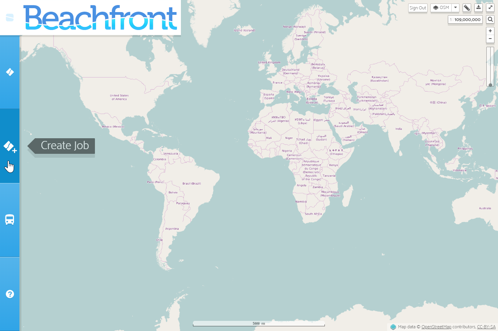

### 2. Draw a Bounding Box to Define the Search Space

Drawing a bounding box is a two-click process.  Click once to drop the first corner and again to complete the bounding box:

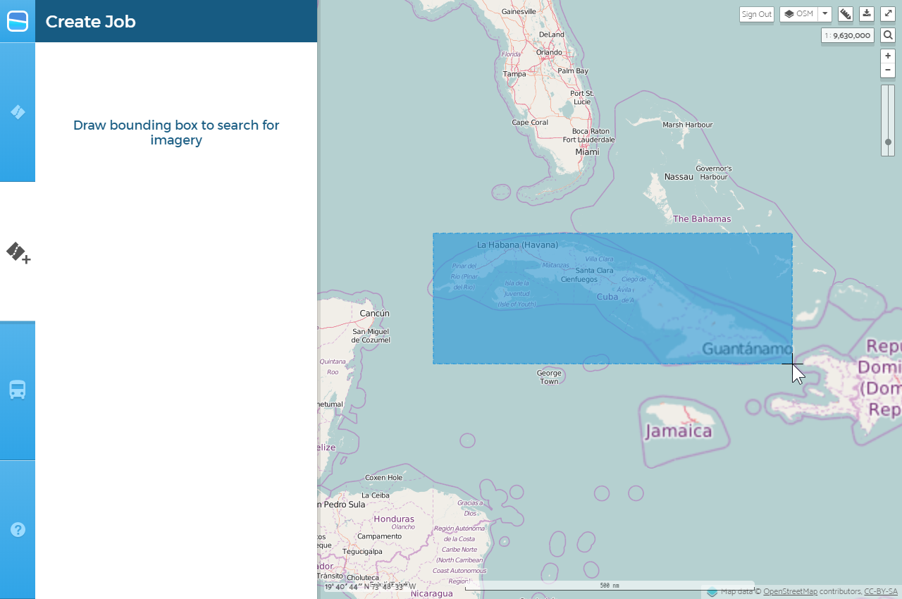

### 3. Adjust Search Criteria and then Execute Search

> __Note:__ Dates should be entered in `YYYY-MM-DD` format, e.g., `2017-07-04`.

Make any necessary adjustments to the imagery source, cloud cover, and date range, and then click on the _Search for Imagery_ button to execute a search using the selected filtering criteria:

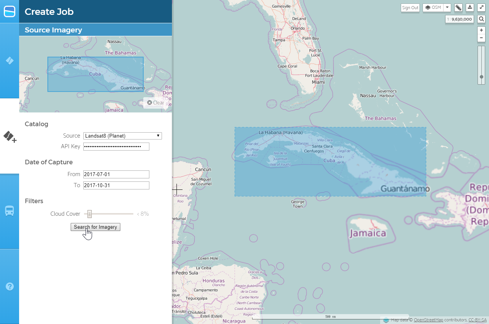

After a moment, footprints of the scenes found in the catalog should render on the map. You can readjust the filtering criteria and re-execute the search as many times as you need:

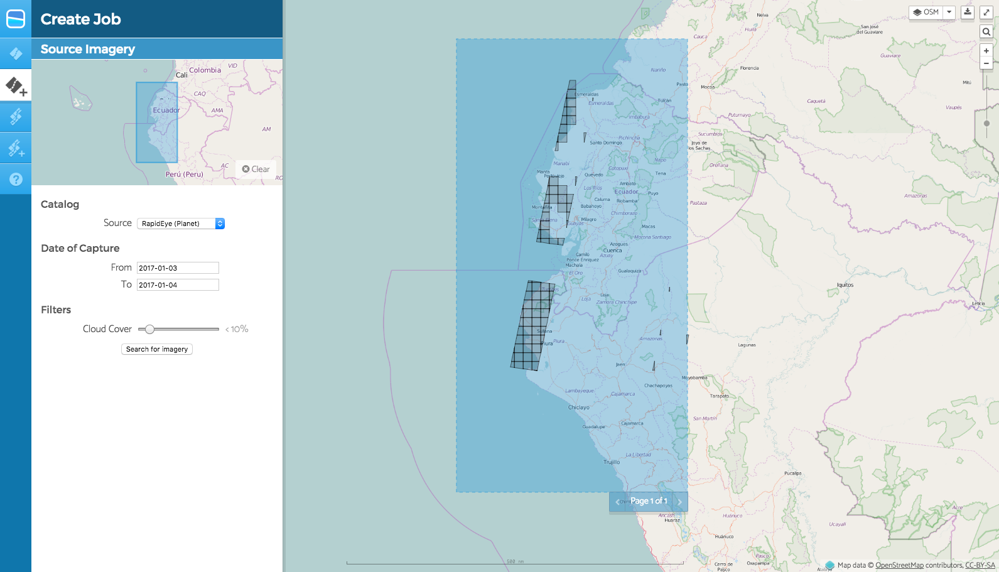

### 4. Click on a Scene's Footprint to Bring up Metadata and a Preview

> __Note__: If the full-color preview does not load on the map, please contact the Beachfront team for technical support.

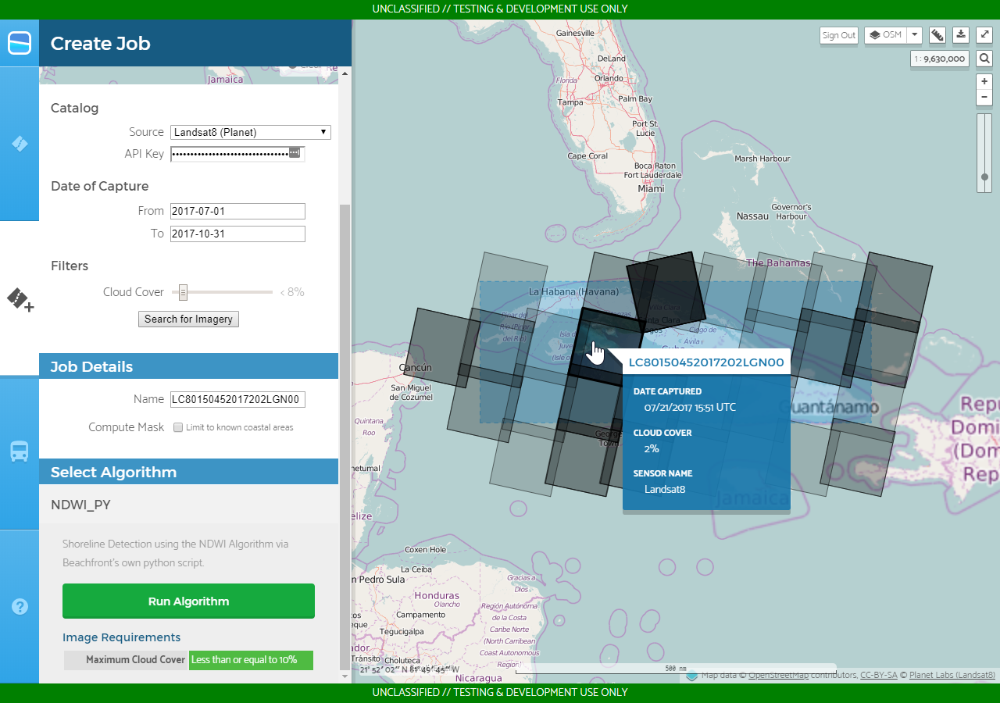

## Creating a Job

> __Note:__ Start from the end of the instructions for [Searching for Scenes](#searching-for-scenes).

### 1. After Picking a Scene, Find a Compatible Algorithm

Look under the _Select Algorithm_ section to see what algorithms are available.  Some algorithms have strict requirements in order to yield meaningful coastline vector data:

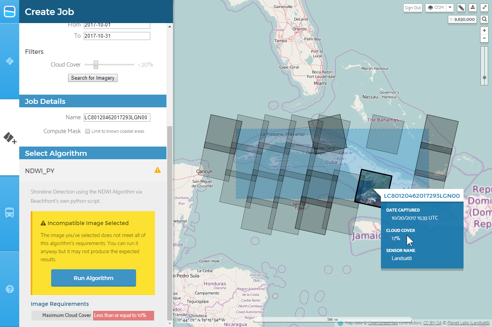

<!-- TODO: I was not able to get the "incompatible image" screenshot when updating
     screenshots, so an old screenshot is used here. We should fix this. --Filip -->

### 2. After Picking an Algorithm, Submit the Scene for Processing

> __Note__: By default, Beachfront will name the job after the scene being processed.  You can optionally give a custom name to a job if desired.

<!-- -->

> __Note__: Algorithm processing time may vary depending on the size/age of the scene (i.e., bigger scenes require more time to process and older scenes require more time to request from archives) and the Beachfront system load at the time of execution.  If a scene takes longer to process than two hours, please contact the Beachfront team for technical support.

To submit the scene for algorithm processing, click the _Run Algorithm_ button:

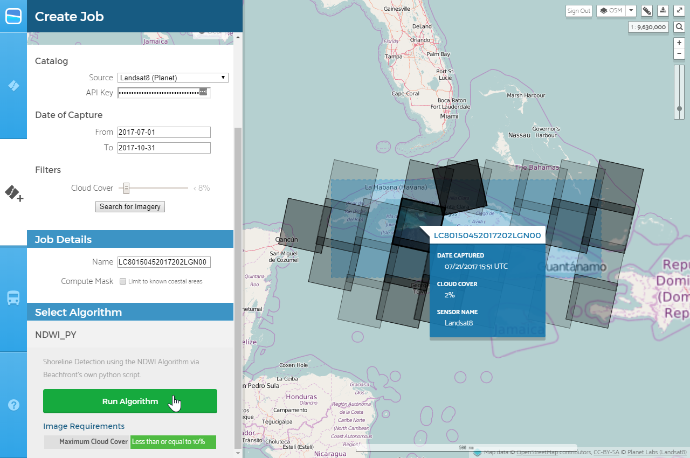

## Viewing a Job's Results

### 1. Navigate to the _Jobs_ Menu

The ___Jobs___ menu will list the status and details for all jobs you are tracking:

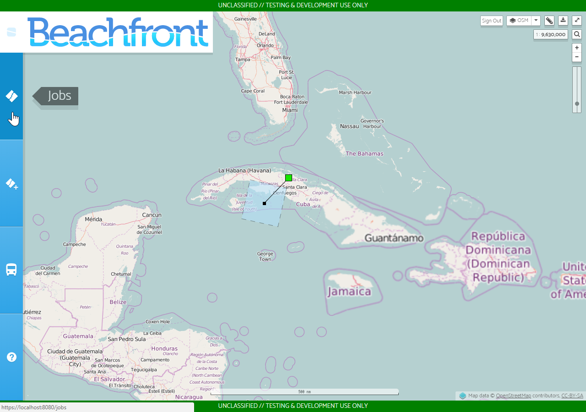

### 2. Find the Job you Want to View and then Click _View on Map_

> __Note:__ You can also click any visible job frame directly on the map to "select" it in the same way.

Selecting a job from the ___Jobs___ menu will pan and zoom the map to the job's frame:

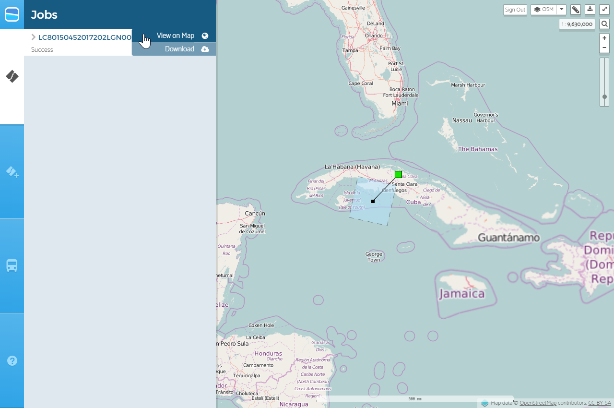

### 3. Shoreline Detections will Render for any Successful Job

> __Note:__ If you select a job that is currently running, shoreline detections automatically appear once it successfully completes.  If this does not happen, please notify the Beachfront team for technical support.

You can also view extra information about a particular job by expanding the job's
row in the ___Jobs___ menu:

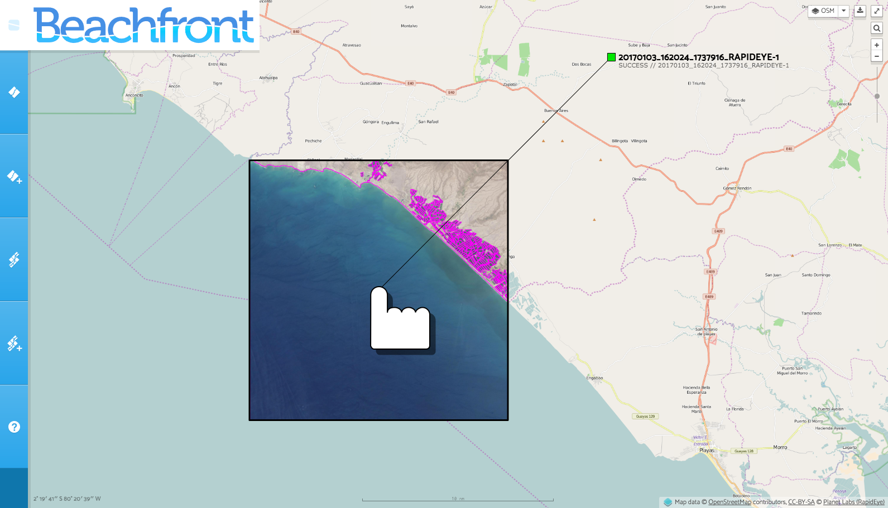

### 4. Click "Download" Button to Download Detections in QGIS compatible formats

You can download the shoreline result in a few geospatial formats. They will
each have a filename based on the source image. For example, using a Landsat8
source:

-GeoJSON - `LC80150442018109LGN00.geojson`
-GeoPackage - `LC80150442018109LGN00.gpkg`
-Shapefile - `LC80150442018109LGN00.zip` (container for the multiple relevant files)

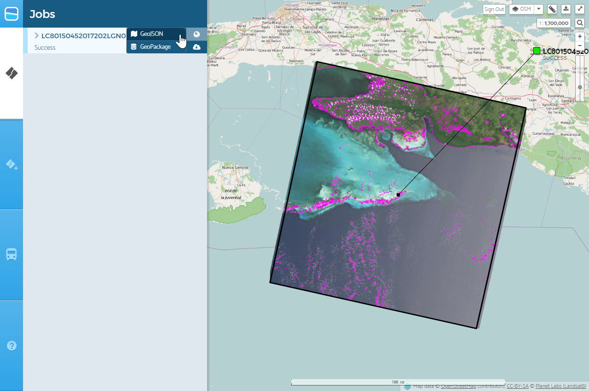

## Removing a Job from your Jobs List

### 1. Navigate to the _Jobs_ Menu

The ___Jobs___ menu will list the status and details for all jobs you are tracking:

### 2. Expand the Job's Details, then Click _Remove this Job_

> __Note:__ The job does not get deleted from the system; it just won't show up in your tracking list anymore unless you visit that job's URL again.

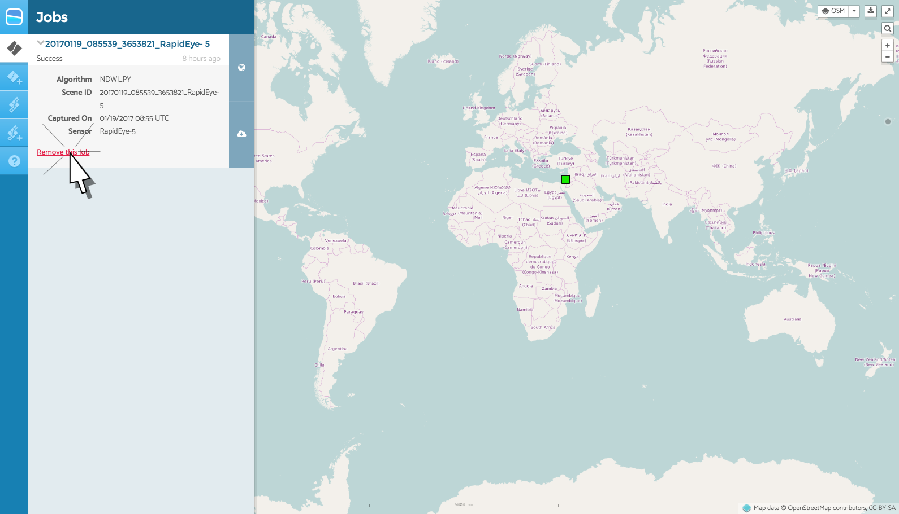
