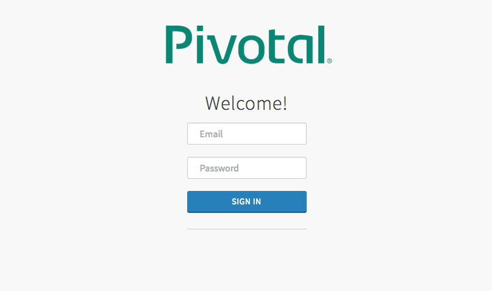
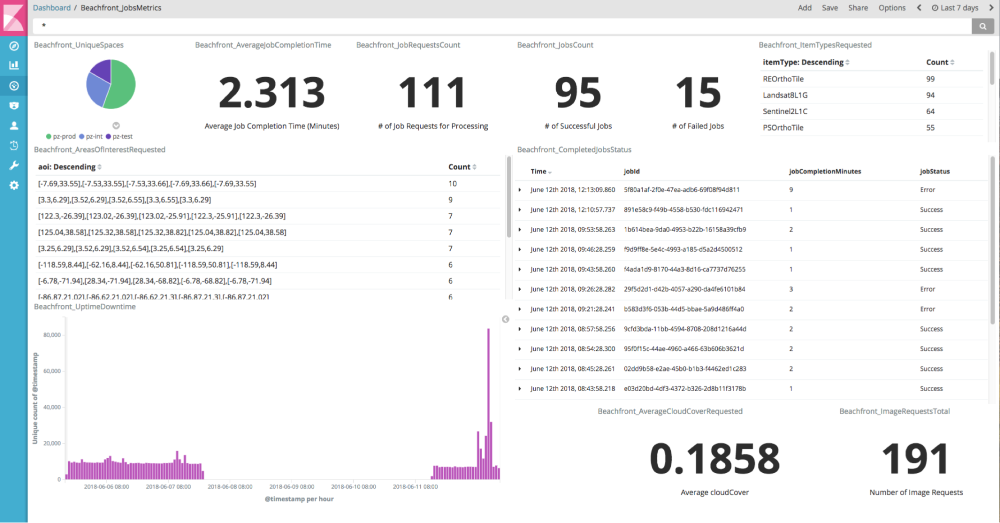
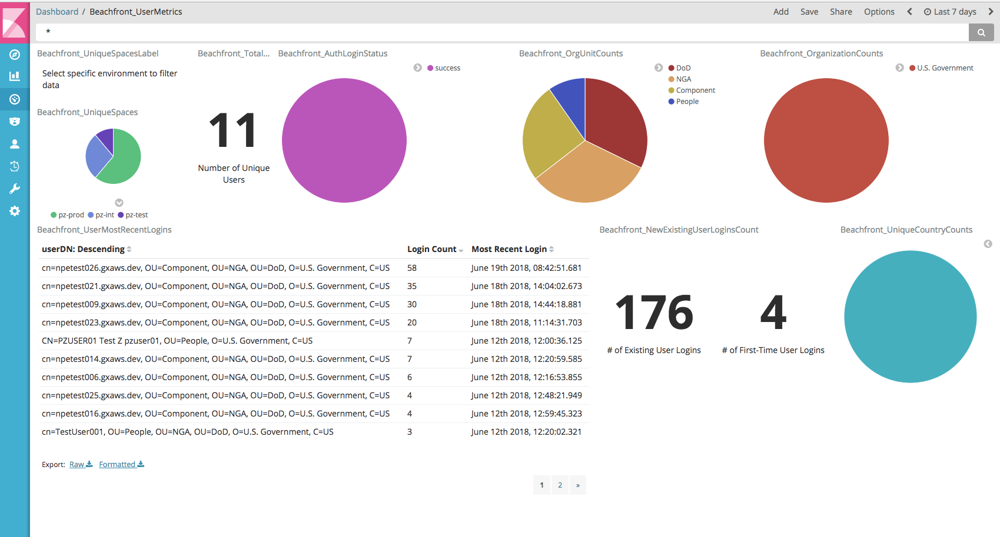
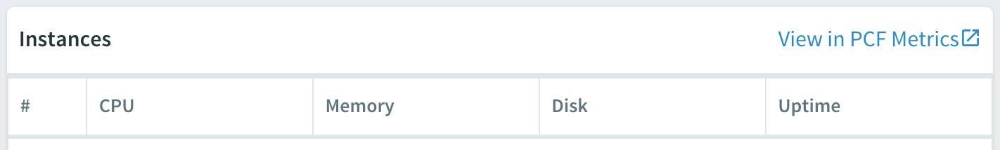
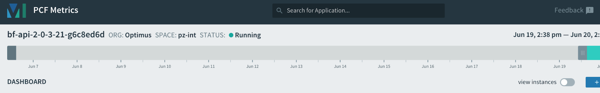
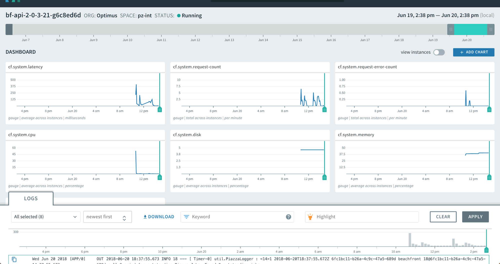
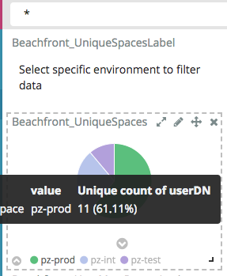
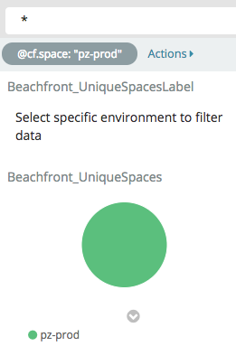
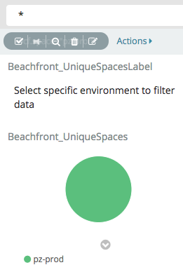

# Metrics

## Introduction
Beachfront is a set of open-source cloud services that enables users to leverage detection algorithms and imagery sources to update global coastline vectors. Users can exploit third-party imagery data using detection algorithms to generate coastline vector data. It provides users the ability to automatically extract large sections of coastline to produce timely, dynamic data in support of multiple communities using the best-available source imagery. Although intended for shorelines, Beachfront can be modified to serve other feature communities of interest to assist in automated feature and object detection if other algorithms are available.

The purpose of this guide is to serve as a walkthrough for getting access to metrics dashboards, which can provide useful details relating to, though not limited to, the following details:

| Requirement | Description of Purpose |
|-------------|------------------------|
| Beachfront application users | Providing an understanding of who is engaging with Beachfront. |
| Organizations represented from recent users | This provides an understanding of, not only who, though which unique groups or missions Beachfront is helping. |
| Successful and unsuccessful login attempts | This provides an important note if the system is experiencing repeated login rejections and why. |
| Application uptime & downtime | Providing an overview of the system dependability and reliability as an operational environment. |
| Processing times | Provides an understanding of how long the system is taking to process each job, so the appropriate expectations can be formed for users interacting with Beachfront. |
| Areas of Interest (AOI) Visited | This provides application owners the ability to understand what areas of interest (AOI) analysts are using Beachfront to look at. |
| Requested Image Types | This provides an understanding of which types of information are relevant to what users are requesting |
| Processing Request Details | This provides an understanding, particularly from a system perspective, for how well Beachfront is performing, as well as how many job requests are succeeding compared to how many are failing. |
| Number of Image Requests | This provides an understanding of whether or not the users are finding relevant responses through Beachfront |
| Cloud Cover Requests | This provides developmental metrics for what cloud cover levels are preferred. |
| New Beachfront users compared to existing Beachfront users | This provides context to Beachfront for how many new and pre-existing users are engaging with the system, in order to gauge an understanding for how well mission outreach is performing, along with understanding if users are finding what they are looking for in order to being retained and want to return. |
| Scene Size | Knowing the file size of the image is a baseline statistic to help Beachfront determine what resource requirements are needed to process a scene. |
| Geographic Scene Size | This metric is to be collected for resource planning and other business analytics. This metric might be used help determine performance and how much information we are processing in a certain period of time. |
| Activation Time | This metric helps understand how long Beachfront is taking to activate jobs for a particular data provider |
| Output Size | This metric will help us understand how much data is being stored for each coastline produced. |
| Maximum Memory Usage (PCF) | This helps us understand what memory utilization is required in order to better allocate more appropriate resources to services. |
| Maximum Disk Space (PCF) | This helps us understand what disk space utilization is required in order to better allocate more appropriate resources to services. |

## Assumptions &amp; Requirements

Prior to navigating this guide, the following assumptions and requirements are made:

* Each user has access to a computer or tablet/mobile device with web browsing functionality available.
* Each user has an active account and valid credentials for accessing and logging into the Kibana application.
* Each user has an account with the appropriate privileges for accessing the necessary datasets, within the necessary environments.
* Kibana is available within the environment interested in, and has already been configured with Beachfront metrics capabilities

## Relevant URL’s

 The table below lists URL to each of the primary Beachfront environments.
 
 | Environment | Component             | URL |
 |-------------|-----------------------|-----|
 | L2 (.io)    | Kibana                | <https://logsearch.system.dev.east.paas.geointservices.io/app/kibana> |
 | L2 (.io)    | Pivotal Cloud Foundry | <https://apps.system.dev.east.paas.geointservices.io> |
 | L4 (.mil)   | Kibana                | <https://logsearch.ops.east.paas.nga.mil/app/kibana> 

## Kibana Application Overview
Beachfront currently uses the Kibana/Logsearch application for displaying metrics, which is made available through GeoIntServices. While this guide will make the effort to provide a thorough understanding of the Beachfront metrics capabilities that are made available, it is important to note that this guide is not intended to provide an exhaustive understanding or overview of how to use the entirety of the Kibana/Logsearch application. As more metrics-specific capabilities are rolled out, this document will be updated to reflect these changes/updates.

For an official overview or tutorial on using Kibana/Logsearch, users can navigate to the official Kibana [website](https://www.elastic.co/products/kibana) and [getting-started-guide](https://www.elastic.co/guide/en/kibana/current/getting-started.html).

### Accessing Kibana

To access kibana, users can follow the steps below:

1. Open a web browser on a computer or tablet/mobile device.
2. Navigate to the kibana URL of the environment interested in viewing.
3. A login screen will appear

4. Enter email/username and password for your user account, and select the ‘SIGN IN’ button. Once logged in with valid environment-specific credentials, you will be navigated to the kibana main page.

### Kibana Overview
Kibana has several components. At the core, users will mainly interact with kibana through 2-3 components: search (discover), visualizations, and dashboard.

#### Discover
The discover section allows for searching through the data. This provides the data in a more table-like format, for looking at specific records, as well as filtering to look at specific fields. For more details on the discover section, users can reference the Elastic [website](https://www.elastic.co/guide/en/kibana/current/discover.html) discovery details page.

#### Visualizations
The visualizations section allows data fields to be transformed into a more visual representation, rather than a table-like display. For more details on the discover section, users can reference the Elastic [website visualizations details page](https://www.elastic.co/guide/en/kibana/current/visualizations.html).

#### Dashboards
The dashboards section allows saved visualizations and/or saved searches to be grouped and organized into common layouts. For more details on the discover section, users can reference the Elastic [website dashboards details page](https://www.elastic.co/guide/en/kibana/current/dashboards.html).

## Accessing Beachfront Metrics

Beachfront metrics dashboards can be accessed by following the steps below:

1. Select the “Dashboard” section from within the kibana navigation panel on the left-hand side of the screen.

2. This will open the main dashboards screen, with a table showing all saved dashboards.
    
    Beachfront currently has the following metrics dashboards available:
    
    * [Beachfront User Metrics]() &nbsp;&nbsp;&nbsp; Metrics related to users accessing Beachfront
    * [Beachfront Jobs Metrics]() &nbsp;&nbsp;&nbsp; Metrics related to jobs run on Beachfront, as well as any statistics related

NOTE:

All environments provide the ability to look at all respective environments, as well as filtering to look at one specific environment. To learn about how to apply environment filtering, please reference the Environment Filtering in Dashboards section.

### Beachfront User Metrics
The User metrics dashboard serves the purpose of displaying user-related metrics, such as who has used Beachfront (and how often or how recently), or which organizations, units, and countries are represented by those users. The image below displays an example of what the User metrics dashboard consists of.

The user metrics dashboard is organized with the following components:

 | Dashboard Component        | Description / Purpose |
 |----------------------------|-----------------------|
 | UniqueSpaces               | The different spaces within the environment, with a pie chart breakdown of the percentage of events from each, over the selected time period. To look at just the events for a specific space (i.e. int, test, prod, etc), click on that part of the pie chart. |
 | UserMostRecentLogins       | This provides a list of the users (certificate distinguished names) who have logged into Beachfront, along with a count of the number of times they logged in, and the most recent date/time they logged in, over the selected time period. |
 | TotalUniqueUserLogins      | Provides a numerical count representation for the number of unique users that have used Beachfront over the selected time period. |
 | AuthLoginStatus            | Provides a breakdown of the successful and failed login attempts within Beachfront over the selected time period. |
 | UniqueCountryCounts        | This provides a breakdown of the unique countries represented by the users that have used Beachfront over the selected time period. |
 | OrgUnitCounts              | This provides a breakdown of the unique organizational units represented by the users that have used Beachfront over the selected time period. This provides a breakdown for any entities within the respective organization that the user is a part of (i.e. NGA, DoD, etc). |
 | OrganizationCounts         | This provides a breakdown of the unique organizations represented by the users that have used Beachfront over the selected time period. |
 | NewExistingUserLoginsCount | Provides a side-by-side comparison of the number of existing users, compared to the number of first-time users within Beachfront over the selected time period. |
 
 
### Beachfront Jobs Metrics
The Jobs metrics dashboard serves the purpose of displaying job and system related information about Beachfront over the selected time period. The image below displays an example of what the Jobs metrics dashboard consists of.

The jobs metrics dashboard displays the following components:

 | Dashboard Component            | Description / Purpose |
 |--------------------------------|-----------------------|
 | UniqueSpaces                   | The different spaces within the environment, with a pie chart breakdown of the percentage of events from each, over the selected time period. To look at just the events for a specific space (i.e. int, test, prod, etc), click on that part of the pie chart. |
 | JobRequestsCount               | This specifies the total number of jobs which have been requested over the specified time period. It is important to note that this number is explicitly for the number of jobs requested, not finished. |
 | JobsCount                      | This provides a side-by-side breakdown for the number of jobs which have completed successfully compared to those which have resulted in an error. |
 | ItemTypesRequested             | This provides a table representation for the various imagery item types which were requested by users when a job was requested. |
 | AreasOfInterestRequested       | This provides a table representation for the various areas of interest (AOI) which were requested by users when a job was requested. |
 | AverageJobCompletionTime       | This specifies the average amount time (in minutes) it took jobs to complete processing. |
 | AverageJobActivationTime       | This specifies the average amount time (in seconds) it took jobs to complete activation. |
 | CompletedJobsStatus            | This provides the status for each job and how it completed after being run. It also lists the amount of time it took for the job to run. |
 | UptimeDowntime                 | This provides a graph outlining when the system was up or down, over the specified time period. When certain times show a count of 0, that represents a time-period when the system was not available. |
 | AverageSceneSizeGeographicArea | This is used to help determine performance and how much information we are processing in a certain period of time |
 | AverageGeoJSONSize             | This metric will help us understand how much data is being stored for each coastline produced |
 | AverageCloudCoverRequested     | This provides a table representation for the average cloud cover that was requested by users when a job was requested. |
 | ImageRequestsTotal             | This specifies the total number of images that were requested for download over the selected time period. |
 | AverageSceneFileSize           | The baseline statistic to help Beachfront determine what resource requirements are needed to process a scene. |

### PCF-related Metrics
Some of the requested metrics requested for Beachfront involve metrics that are available directly through Pivotal Cloud Foundry (PCF), which is the underlying architecture that Beachfront components run on. PCF provides these metrics which relays system resources and utilization for each instance of the Beachfront components running. For any current or future PCF-related metrics requirements, users can follow the steps below in order to find the system-related resources metrics.

1. Log into the PCF web portal. Refer to the [Relevant URL's](#relevant_urls) section for assistance, if necessary.
2. The main screen should display the various environments that you have been granted access to. Hover over and click on the environment of interest (e.g. pz-int, pz-test, pz-prod).
3. You should be navigated to the page for the specific environment selected, which lists all the apps running for that environment.
4. Select the row with the application of interest, and then click on the “Name” column cell. This will navigate you to the page displaying the events and other information related to the application of interest.
5. Locate the “Instances” section on the right side of the page, as shown in the image below.

6. Click on the “View in PCF Metrics” link. A new browser window will open for PCF metrics.
7. Login to PCF Metrics using the same credentials used for logging into PCF in step 1.
8. The PCF Metrics page will display for the instance selected in step 4.

9. The dashboard displays several system-related metrics, such as latency, number of requests, cpu, disk, memory, and system events metrics, along with being able to look at logs for this instance.

### Environment Filtering in Dashboards
All environments provide the ability to look at all respective environments, as well as filtering to look at one specific environment. To add and remove filtering within the kibana dashboard, please follow the steps outlined below.

#### Adding Environment Filter 
To add an environment filter:

1. Locate the “Beachfront_UniqueSpaces” component within the dashboard. It can be found in the upper-left corner of the dashboard, under the search bar and to the right of the menu bar.

2. If you hover the mouse/pointer over any of the sections within the pie chart, a pop-up will display which environment space it is, as well as particular counts for that environment.
3. Once the environment space of interest is determined, press the mouse on that space to select it. A gray oval-shaped bubble should appear directly under the search bar, as shown below.

4. The values in the dashboard should update shortly to reflect the filtered values.

#### Removing Environment Filter
If an environment filter has been applied using the above instructions, to remove the filter:

1. Locate the gray oval-shaped bubble under the search bar.

2. Once found, hover over the gray bubble. Some icons should appear.

3. Locate the trash can icon and select it. The gray bubble should disappear and the values in the dashboard should update shortly to reflect the unfiltered values.

