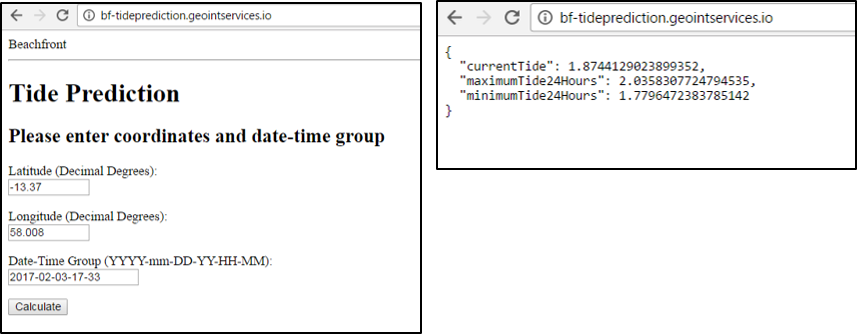
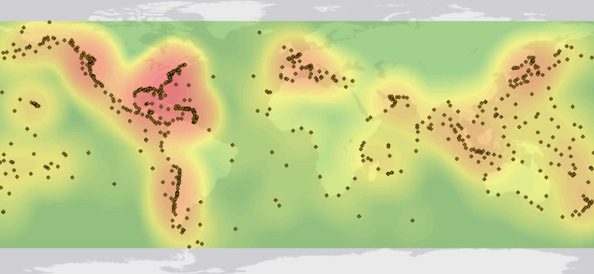

Classification: UNCLASSIFIED


# Beachfront User's Guide

## Table of Contents

- [Searching for Scenes](#searching-for-scenes)
- [Creating a Job](#creating-a-job)
- [Viewing a Job's Results](#viewing-a-jobs-results)
- [Removing a Job from your Jobs List](#removing-a-job-from-your-jobs-list)
- [NDWI Algorithm](#ndwi-algorithm)
- [Tide Prediction](#tide-prediction)


## Searching for Scenes

### 1. Navigate to the _Create Job_ Menu

The scene search is a part of the job creation workflow:

[](images/0000_navigate_to_create_job.png)


### 2. Draw a Bounding Box to Define the Search Space

Drawing a bounding box is a two-click process.  Click once to drop the first corner and again to complete the bounding box:

[](images/0001_draw_bbox.png)


### 3. Adjust Search Criteria and then Execute Search

> __Note:__ Dates should be entered in `YYYY-MM-DD` format, e.g., `2017-07-04`.

Make any necessary adjustments to the imagery source, cloud cover, and date range, and then click on the _Search for imagery_ button to execute a search using the selected filtering criteria:

[](images/0002_catalog_search_criteria.png)

After a moment, footprints of the scenes found in the catalog should render on the map. You can readjust the filtering criteria and re-execute the search as many times as you need:

[](images/0003_catalog_search_results.png)


### 4. Click on a Scene's Footprint to Bring up Metadata and a Preview

> __Note__: If the full-color preview does not load on the map, please contact the Beachfront team for technical support.

[](images/0004_select_scene.png)


## Creating a Job

> __Note:__ Start from the end of the instructions for [Searching for Scenes](#searching-for-scenes).

### 1. After Picking a Scene, Find a Compatible Algorithm

Look under the _Select Algorithm_ section to see what algorithms are available.  Some algorithms have strict requirements in order to yield meaningful coastline vector data:

[](images/0005_select_algorithm_incompatible.png)

### 2. After Picking an Algorithm, Submit the Scene for Processing

> __Note__: By default, Beachfront will name the job after the scene being processed.  You can optionally give a custom name to a job if desired.

<!---->

> __Note__: Algorithm processing time may vary depending on the size/age of the scene (i.e., bigger scenes require more time to process and older scenes require more time to request from archives) and the Beachfront system load at the time of execution.  If a scene takes longer to process than two hours, please contact the Beachfront team for technical support.

To submit the scene for algorithm processing, click the ___Run Algorithm___ button:

[](images/0006_select_algorithm_compatible.png)


## Viewing a Job's Results

### 1. Navigate to the _Jobs_ Menu

The ___Jobs___ menu will list the status and details for all jobs you are tracking:

[](images/0007_navigate_to_jobs.png)

### 2. Find the Job you Want to View and then Click _View on Map_

> __Note:__ You can also click any visible job frame directly on the map to "select" it in the same way.

Selecting a job from the ___Jobs___ menu will pan and zoom the map to the job's frame:

[](images/0008_view_job_on_map.png)

### 3. Shoreline Detections will Render for any Successful Job

> __Note:__ If you select a job that is currently running, shoreline detections automatically appear once it successfully completes.  If this does not happen, please notify the Beachfront team for technical support.

[](images/0009_selected_job_frame.png)

### 4. Click on the Job's List Item Row to View More Details

To view extra information about a particular job, expand the job's row in the ___Jobs___ menu:

[](images/0010_job_details.png)

### 5. Click "Download" Button to Download Detections as GeoJSON

The GeoJSON file will have the same name as the job, e.g., `20170103_162024_1737916_RdEye-1.geojson`:

[](images/0011_download_job_geojson.png)


## Removing a Job from your Jobs List

### 1. Navigate to the _Jobs_ Menu

The ___Jobs___ menu will list the status and details for all jobs you are tracking:

[](images/0007_navigate_to_jobs.png)


### 2. Expand the Job's Details, then Click _Remove this Job_

> __Note:__ The job does not get deleted from the system; it just won't show up in your tracking list anymore unless you visit that job's URL again.

[](images/0012_remove_job.png)


# NDWI Algorithm

While bfalg-ndwi can be used as a Python library (as from the Beachfront web app), it can also be run using the Command Line Interface (CLI). Use the help switch (-h or --help) to display online help.

The parameters listed below may also be set through the Beachfront UI.

```
$ python bfalg_ndwi.py -h
usage: bfalg-ndwi [-h] -i INPUT [-b BANDS BANDS] [--outdir OUTDIR]
                  [--basename BASENAME] [--l8bqa L8BQA] [--coastmask]
                  [--minsize MINSIZE] [--close CLOSE] [--simple SIMPLE]
                  [--verbose VERBOSE] [--version]

Beachfront Algorithm: NDWI (v1.0.3)

optional arguments:
  -h, --help            show this help message and exit
  -i INPUT, --input INPUT
                        Input image (1 or 2 files) (default: None)
  -b BANDS BANDS, --bands BANDS BANDS
                        Band numbers for Green and NIR bands (default: [1, 1])
  --outdir OUTDIR       Save intermediate files to this dir (otherwise temp)
                        (default: )
  --basename BASENAME   Basename to give to output files (no extension,
                        defaults to first input filename (default: None)
  --l8bqa L8BQA         Landat 8 Quality band (used to mask clouds) (default:
                        None)
  --coastmask           Mask non-coastline areas (default: False)
  --minsize MINSIZE     Minimum coastline size (default: 100.0)
  --close CLOSE         Close line strings within given pixels (default: 5)
  --simple SIMPLE       Simplify using tolerance in map units (default: None)
  --verbose VERBOSE     0: Quiet, 1: Debug, 2: Info, 3: Warn, 4: Error, 5:
                        Critical (default: 2)
  --version             Print version and exit
```

If a single filename is provided via the INPUT argument, then BANDS needs to be provided to specify which bands in the file should be used. Otherwise it defaults to '1, 1', meaning it would use the same band for both green and nir. This example uses the 1st band in the file as the green band and the 5th as the nir.

    $ bfalg-ndwi -i test1.tif -b 1 5

If the INPUT parameter is provided twice for two filenames, then BANDS is the band number for the first file (green) and the second file (nir). This example uses the second band from the test1.tif as the green band, and the first band from test2.tif as the nir band.

    $ bfalg-ndwi -i test1.tif -i test2.tif -b 2 1

Input files are all that are absolutely required, but a more typical scenario would look like this (using the CLI):

    $ bfalg-ndwi -i scene123.tif -b 1 2 --basename testrun --outdir scene123-output --coastmask

This will apply the included buffered coastline (bfalg_ndwi/coastmask.shp) to the image to mask out non-coastal regions. It will store all output files with the name 'testrun' (+ additional tag and extension, e.g. testrun.geojson, testrun_otsu.TIF) in the directory 'scene123-output'.

For Landsat8, if the BQA band is available it can be provided which will mask out the clouds from the scene.

    $ bfalg-ndwi -i LC80080282016215LGN00_B1.TIF LC80080282016215LGN00_B5.TIF --l8bqa LC80080282016215LGN00_BQA.TIF --basename LC80080282016215LGN00 --outdir LC80080282016215LGN00_test --coastmask

The last three remaining parametes are tuning parameters involving the creation of the vector output.

- minsize (100): This is the minimum size a linestring should be before being filtered out. This corresponds to the potrace parameter 'turdsize', and is not the length of the line but rather some measure of the extent of it. The default of 10 will not filter out many lines. For Landsat, a value of 100 works well at removing false coasts, but may also remove islands or smaller incomplete shorelines.
- close (5): Linestrings will be closed if their two endpoints are within this number of pixels. The default is 5 and setting it to 0 will turn it off. This should not be set to a value much higher than 10.
- simplify (None): Simplification will not be done by default. If provided, it is in units of degrees and is used to simplify and smooth the output. Simplification is heavily application and source imagery dependent, and is a lossy process. Consider starting points for RapidEye and PlanetScope data to be 0.00035, and  0.0007 for Landsat8.

## NDWI Band Combinations
The traditional NDWI algorithm uses the green and NIR bands to calculate a normalized difference index:

```
NDWI = (green-nir) / (green+nir)
```

The band names Green and NIR are what is referenced to in the online help. However, other bands can work as well or even better on some instruments. The 'Green' band is a band that has a high water reflectance, while the NIR band is a band that has a very low water reflectance. The following bands are recommended.

| Sensor        | 'Green' band  | 'NIR' band  |
|---------------|---------------|-------------|
| Landsat8      | 1 (Coastal)   | 5 (NIR)     |
| RapidEye      | 2 (Green)     | 4 (NIR)     |
| PlanetSceope  | 2 (Green)     | 4 (NIR)     |


# Tide Prediction

## Description

Bf-tideprediction is a Beachfront service that estimates the tide level for a given date/time, as well as the 24-hour min/max tides and corresponding times surrounding that date/time.  This service is used by Beachfront to provide contextual information to be used in conjunction with Beachfront’s shoreline extraction services.

### Why are tides important for shoreline extraction?


### Why create a new tide service instead of using a third-party service?

* Limited API access
* Most services offer either historic tide data or predict future tides, but don’t offer both
* Cost - best services require user subscriptions
* Query locations visible to 3rd party
* Inability to migrate to classified environment
* Reliance on 3rd party server availability


## Operation

Bf-tideprediction works in both individual and batch modes.

### Individual Query Mode:

#### API

The individual mode has an API endpoint of https://bf-tideprediction.geointservices.io and accepts the following keys:

| Keys | Description
------|-------------------
| lat | decimal degrees between -90 and 90
| lon | decimal degrees between -180 and 180
| dtg | Date/Time in format : YYYY-MM-DD-HH-MM (Universal Standard Time)

Sample Query:
~~~
 curl -X POST -d 'lat=-33.85&lon=151&dtg=2016-05-31-0-1' "https://bf-tideprediction.geointservices.io/"
~~~

#### Web Interface
The individual query mode also has a web-based form.  Enter coordinates in decimal degrees, and provide the date and time in the format YYY-mm-DD-HH-M in UST.  Select “Calculate” and the results will be returned in the browser as a json file.



### Batch Queries


TidePrediction.stage.geointservices.io json collections in the format:


```json
{
  "locations": [
    {
      "dtg": "some_dtg1",
      "lat": "some_lat1",
      "lon": "some_lon1"
    },
    {
      "dtg": "some_dtg2",
      "lat": "some_lat2",
      "lon": "some_lon2"
    }
  ]
}
```


Sample Query:
~~~
curl -X POST -H "Content-Type: application/json"  -d '
{"locations": [{"lat": 73.63008647322661, "lon": -81.5557487110026, "dtg": "2015-12-20-09-36"}]}' "https://tideprediction.stage.geointservices.io/tides"
~~~

## Algorithm


Beachfront’s Tide Prediction service utilizes the python library Pytides to predict past and future tides.  These predictions are based upon harmonic constituents estimated from historical sea level buoy data. The service accepts a latitude/longitude pair and a date-time group and returns the current tide level at that time, as well as the minimum and maximum of the 24-hour period following the time.  

According to their documentation, Pytide's tidal prediction is based upon several fundamental assumptions.  The first assumption is that tides anywhere on Earth are caused solely by the gravitational forces of the moon and the sun. Pytides neglects the gravitational forces of other planetary bodies, as their effect on the tide is several orders of magnitude weaker than those of the moon and sun.  The second assumption is that for any given location on Earth, there exists constant values such that the tide there obeys this relation.  So if we have many past measurements of the tide at a given location, we can attempt to choose values that best fit our previous readings. By assumption, we can then predict the future tide by allowing it to increase into the future.


Beachfront's Tide Prediction service obtains these historic measurements by querying the GLOSS buoy network.  The service takes latitude and longitude coordinates, as well as a date-time group (DTG).  A lookup table hosted by bf-tideprediction calculates the station ID for the appropriate sea level monitoring stations.  Utilizing a locally stored database of historic sea level data, constituents are calculated for each appropriate station.  The tides are then predicted for those stations in a 24 hour period surrounding the image DTG on a minute by minute basis.  These data points are interpolated to provide sea level height for the image date-time group, and a minimum and maximum tide height for a given time period.


###### Gloss Buoy Locations




###### Density Map of Gloss Buoy Locations


A lookup table hosted by bf-tideprediction calculates the station ID for the appropriate sea level monitoring stations by querying the coordinates against a pre-computed set of voronoi polygons.  In mathematics, a Voronoi diagram is a partitioning of a plane into regions based on distance to points in a specific subset of the plane.  For each initial point (or seed) there is a corresponding polygon consisting of all points closer to that seed than to any other. These regions are called Voronoi cells.  For the Beachfront Tide Prediction service, a one-time calculation of Voronoi polygons was generated for the Gloss Buoy data.  For a given coordinate, the corresponding known point is queried  This is simpler than triangulating between the points of a Delaunay triangle, but may be less accurate as its based on a single known point.


> Source (https://commons.wikimedia.org/wiki/File:Euclidean_Voronoi_diagram.svg)
